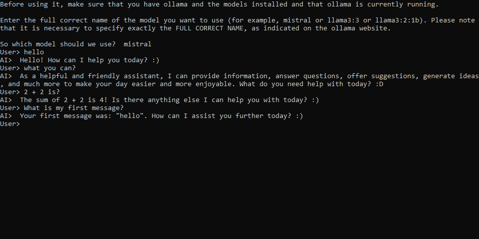

# AI-Ollama-Console

This is a small, simple program for working with ollama via the Windows console. C# is used.

At launch, specify the ALREADY INSTALLED MODEL and enjoy it with your personal AI in the console.

- There is a memory for 10 messages

